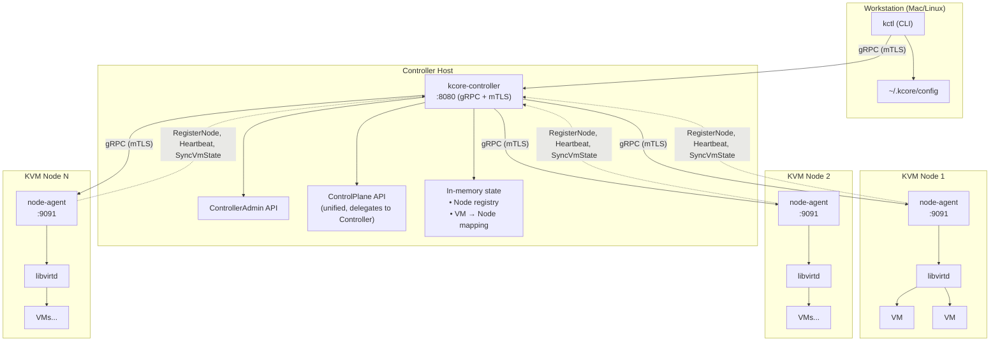
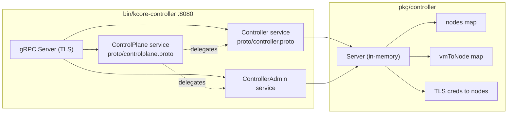
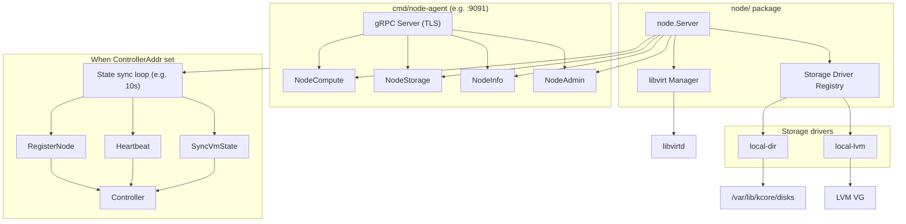
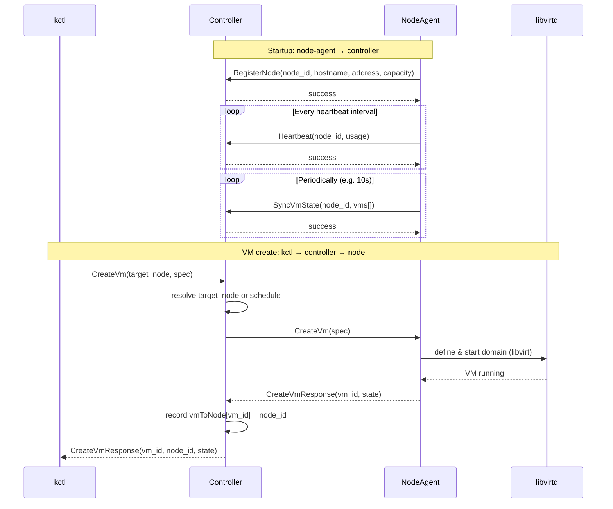
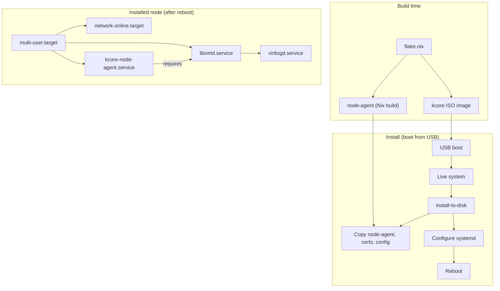
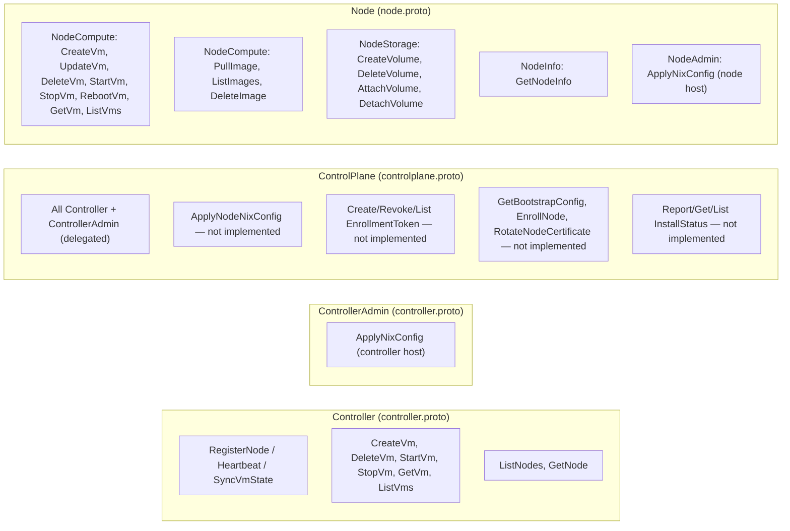
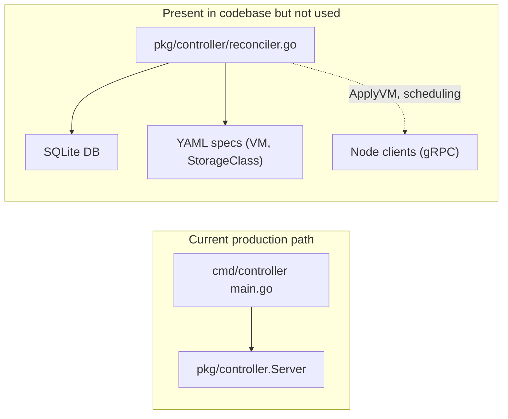

# kcore Architecture — Mermaid Schematics

This document provides Mermaid diagrams of the current kcore architecture, based on the project docs and codebase.

**Viewing tip:** If diagrams still look small, open this file in [Mermaid Live Editor](https://mermaid.live), paste one diagram at a time, and use the zoom/export controls for a larger view.

---

## 1. High-Level System Architecture



---

## 2. Controller Services (Single Binary)

The controller binary (`cmd/controller`) exposes three gRPC services on the same port. ControlPlane delegates to the same in-memory Controller implementation.



---

## 3. Node Agent Internal Structure

Each node runs one node-agent process. It implements the node proto services and talks to libvirt and storage drivers.



---

## 4. Node Registration and VM Creation Flow



---

## 5. List VMs Flow (Single Node vs All Nodes)

```mermaid
%%{init: {'themeVariables': {'fontSize': '20px', 'fontFamily': 'arial'}}}%%
flowchart LR
    subgraph ListAll["kctl get vms (no --node)"]
        kctl1["kctl"] -->|ListVms(target_node='')| Ctrl1["Controller"]
        Ctrl1 -->|query all registered nodes| N1["Node 1"]
        Ctrl1 --> N2["Node 2"]
        Ctrl1 --> N3["Node N"]
        N1 --> Ctrl1
        N2 --> Ctrl1
        N3 --> Ctrl1
        Ctrl1 -->|aggregate| kctl1
    end

    subgraph ListOne["kctl get vms --node 192.168.40.146:9091"]
        kctl2["kctl"] -->|ListVms(target_node=...)| Ctrl2["Controller"]
        Ctrl2 -->|query that node only| N4["Node 192.168.40.146"]
        N4 --> Ctrl2
        Ctrl2 --> kctl2
    end
```

---

## 6. NixOS / ISO Deployment Context



---

## 7. API Surface Summary



---

## 8. Unused / Alternative Path (Reconciler)

The codebase also contains a SQLite-based controller implementation that is **not** wired into the main controller binary.



---

## Ports and Config Summary

| Component        | Default port | Config / binary |
|-----------------|-------------|------------------|
| Controller      | :8080       | Flags: `-listen`, `-cert`, `-key`, `-ca` |
| Node agent      | :9091       | `/etc/kcore/node-agent.yaml` (NodeID, ControllerAddr, TLS, networks, storage) |
| kctl            | —           | `~/.kcore/config` (controller address, TLS) |

**Communication:** All gRPC with mTLS (client certs for kctl → controller; controller uses its cert to dial nodes).

---

*Generated from docs: ARCHITECTURE.md, ARCHITECTURE_COMPLETE.md, PROJECT_STRUCTURE.md, CONTROLPLANE_API.md, intro.md, NEXT_STEPS.md, and proto definitions.*
