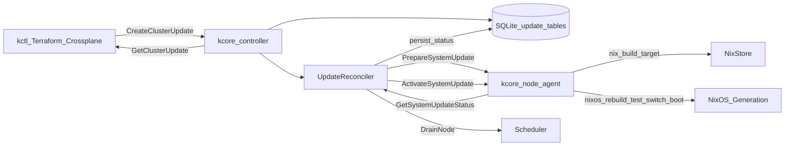

# NixOS-Native Cluster Updates

**Operator-focused procedures:** see [`cluster-and-node-upgrades.md`](./cluster-and-node-upgrades.md).

This document designs the update path for running kcore nodes and whole
clusters. The goal is to stop treating a new ISO as the only upgrade path and
instead use NixOS generations, flake-pinned kcore packages, and controller-led
rolling reconciliation.

The operator-facing intent should be declarative: `kctl`, Terraform, and
Crossplane all submit the same desired update object to the controller. The
controller coordinates node-agent work, NixOS activation, workload draining,
health checks, and rollback.

## Scope

In scope:

- kcore Rust package updates: `kcore-controller`, `kcore-node-agent`, `kctl`,
  `kcore-dashboard`, and `kcore-console`.
- NixOS base system updates through pinned flake inputs.
- Rolling node updates with drain and health gates.
- HA controller updates without taking all controllers down at once.
- A stable controller API for `kctl`, Terraform, and Crossplane.

Out of scope for the first implementation:

- Building Terraform or Crossplane providers in this repository.
- Updating arbitrary non-kcore application payloads outside NixOS state.
- Live kernel patching. Kernel/bootloader changes use boot activation plus
  reboot.

## Current State

The repository already has most of the low-level machinery needed for updates,
but it is exposed as config apply and install flows rather than a first-class
cluster update model.

### Existing Control-Plane Primitives

- [`proto/node.proto`](../proto/node.proto) defines `NodeAdmin.ApplyNixConfig`.
  It accepts full Nix text and a `rebuild` flag.
- [`crates/node-agent/src/grpc/admin.rs`](../crates/node-agent/src/grpc/admin.rs)
  writes the received config and starts `nixos-rebuild test &&
  nixos-rebuild switch` in the background.
- [`crates/controller/src/grpc/controller.rs`](../crates/controller/src/grpc/controller.rs)
  stores desired VM/workload state and calls `push_config_to_node` after
  changes.
- [`crates/controller/src/nixgen.rs`](../crates/controller/src/nixgen.rs)
  renders node VM/network Nix config from database state.
- [`crates/controller/src/db.rs`](../crates/controller/src/db.rs) already has
  desired resource tables, schema migrations, per-resource status patterns, and
  replication outbox primitives.
- [`crates/controller/src/disk_reconciler.rs`](../crates/controller/src/disk_reconciler.rs)
  is the closest current model for a persistent resource reconciler that pushes
  node-side changes and records status.

### Existing Installer Limitations

The ISO install flow in [`flake.nix`](../flake.nix) currently copies binaries
into `/opt/kcore/bin` and writes services that execute those fixed paths:

- `/opt/kcore/bin/kcore-node-agent`
- `/opt/kcore/bin/kcore-controller`
- `/opt/kcore/bin/kctl`
- `/opt/kcore/bin/kcore-dashboard`
- `/opt/kcore/bin/kcore-console`

That is workable for fresh installs, but it is not ideal for upgrades:

- The installed system does not know which kcore flake revision produced the
  binaries.
- Nix cannot naturally roll forward/back between kcore package generations.
- The controller cannot ask a node to build and activate a well-defined target
  closure.
- Rollback is limited to whatever system generation was produced by the last
  generated config, not a named kcore release target.

New installs should be Nix-managed from the start (flake-pinned packages in
`/etc/nixos`, not copied binaries under `/opt/kcore/bin`). Existing installs that
still use `/opt/kcore/bin` need a one-time migration path. Because there is no
production deployment constraint yet, that migration **may be destructive**:
for example replacing generated `configuration.nix`, dropping legacy paths, or
even reinstalling from a new ISO is acceptable if it lands the host on a clean
Nix-managed closure. Once production exists, tighten policy (non-destructive
migration, staged rollback).

## Desired Architecture

The update system should make a release target explicit, persist it in the
controller database, reconcile it by node, and expose status to every operator
tool.



The controller remains the source of desired update intent. Node-agent remains
the only component that executes host-level Nix commands on a node.

## Resource Model

### ClusterUpdate

`ClusterUpdate` is the user-facing desired state. It should be idempotent so
Terraform and Crossplane can reconcile it safely.

Suggested fields:

| Field | Purpose |
|-------|---------|
| `name` | Stable resource name, for example `release-0-3-0`. |
| `generation` | Server-assigned monotonic generation. |
| `target.version` | Human version, for example `0.3.0`. |
| `target.flake_ref` | Flake reference, for example `github:kcorehypervisor/kcore/v0.3.0`. |
| `target.flake_rev` | Immutable commit SHA when known. Required before activation. |
| `target.nixpkgs_rev` | Optional nixpkgs pin override or resolved input rev. |
| `target.system_profile` | NixOS profile/attribute to build for nodes. |
| `selector` | Node selector: all nodes, node IDs, labels, DCs, or controller-only. |
| `strategy` | `canary`, `one-at-a-time`, `batch`, or `per-dc`. |
| `strategy.max_unavailable` | Maximum unavailable worker nodes during rollout. |
| `strategy.batch_size` | Batch size for non-canary rollouts. |
| `drain_policy` | Whether to drain VMs/workloads before activation. |
| `activation_mode` | `test`, `switch`, `boot`, or `auto`. |
| `reboot_policy` | `never`, `if-required`, or `always`. |
| `approval_policy` | `manual`, `auto-non-disruptive`, or `auto`. |
| `rollback_policy` | Automatic rollback behavior on failed health gates. |
| `health_gates` | Required checks after prepare, activation, and reboot. |
| `created_at` / `updated_at` | Audit timestamps. |

Example YAML manifest:

```yaml
apiVersion: kcore.io/v1alpha1
kind: ClusterUpdate
metadata:
  name: release-0-3-0
spec:
  target:
    version: "0.3.0"
    flakeRef: "github:kcorehypervisor/kcore/v0.3.0"
    flakeRev: "0123456789abcdef0123456789abcdef01234567"
    systemProfile: "kcore-node"
  selector:
    datacenters: ["DC1"]
  strategy:
    type: one-at-a-time
    maxUnavailable: 1
  drainPolicy:
    enabled: true
    timeoutSeconds: 900
  activation:
    mode: auto
    rebootPolicy: if-required
  approvalPolicy: manual
  rollbackPolicy:
    automatic: true
    onHealthGateFailure: true
```

### NodeUpdateStatus

`NodeUpdateStatus` is controller-owned observed state for each target node.

Suggested fields:

| Field | Purpose |
|-------|---------|
| `update_name` | Owning `ClusterUpdate`. |
| `node_id` | Target node. |
| `observed_generation` | ClusterUpdate generation observed by this node status. |
| `phase` | Current lifecycle phase. |
| `current_version` | Version reported before update. |
| `target_version` | Desired version. |
| `current_system_generation` | Active NixOS generation before activation. |
| `target_system_generation` | Prepared/activated generation. |
| `prepared_closure` | Store path built during prepare. |
| `booted_generation` | Generation currently booted after reboot. |
| `requires_reboot` | Whether target cannot be fully activated without reboot. |
| `last_error` | Stable last error for operators and providers. |
| `last_transition_at` | Phase transition timestamp. |
| `logs_hint` | Journal unit or log path to inspect. |

Node phases:

| Phase | Meaning |
|-------|---------|
| `Pending` | Controller selected the node but has not started work. |
| `Preflight` | Controller checks readiness, approval, disk mode, API compatibility, and strategy constraints. |
| `Preparing` | Node-agent validates flake target and builds/realizes the system closure. |
| `Prepared` | Target closure is ready and recorded. |
| `Draining` | Controller stops or migrates workloads according to policy. |
| `Activating` | Node-agent runs the requested NixOS activation mode. |
| `Rebooting` | Node reboot is requested or observed. |
| `Verifying` | Controller waits for heartbeat, services, controller replication, and workload health. |
| `Succeeded` | Node is on the desired generation and passed health gates. |
| `Failed` | Node failed and rollout is blocked or rolling back. |
| `RollingBack` | Node-agent is activating the previous known-good generation. |
| `RolledBack` | Previous generation is restored and verified. |
| `Cancelled` | Work was cancelled before irreversible activation. |

### ControllerUpdateStatus

For controller nodes, use the same lifecycle with stricter gates:

- Replication must be healthy before a controller update starts.
- Only one controller may update at a time.
- Followers update before the current primary/leader when a leader exists.
- A controller must rejoin replication and report zero critical lag before the
  next controller starts.

## API Design

The update API should be explicit rather than overloading
`ApplyNixConfig`. `ApplyNixConfig` remains useful for generated VM config and
break-glass host config applies.

### Controller RPCs

Add to `Controller` in [`proto/controller.proto`](../proto/controller.proto):

```proto
rpc CreateClusterUpdate(CreateClusterUpdateRequest) returns (CreateClusterUpdateResponse);
rpc GetClusterUpdate(GetClusterUpdateRequest) returns (GetClusterUpdateResponse);
rpc ListClusterUpdates(ListClusterUpdatesRequest) returns (ListClusterUpdatesResponse);
rpc PlanClusterUpdate(PlanClusterUpdateRequest) returns (PlanClusterUpdateResponse);
rpc ApproveClusterUpdate(ApproveClusterUpdateRequest) returns (ApproveClusterUpdateResponse);
rpc CancelClusterUpdate(CancelClusterUpdateRequest) returns (CancelClusterUpdateResponse);
rpc RollbackClusterUpdate(RollbackClusterUpdateRequest) returns (RollbackClusterUpdateResponse);
```

Semantics:

- `PlanClusterUpdate` is read-only. It resolves target nodes, checks strategy,
  reports incompatible nodes, and estimates whether reboot is likely.
- `CreateClusterUpdate` is an upsert by `name`. If the spec is unchanged,
  return `UNCHANGED`; if the spec changes before activation, increment
  generation.
- `ApproveClusterUpdate` moves manual updates from `AwaitingApproval` to
  `Ready`.
- `CancelClusterUpdate` stops unstarted work and marks active nodes
  cancellation-pending. It must not interrupt a node mid-activation.
- `RollbackClusterUpdate` requests rollback for failed or completed updates.

Add replication events for HA controllers:

- `cluster_update.create`
- `cluster_update.status`
- `cluster_update.approve`
- `cluster_update.cancel`
- `cluster_update.rollback`

### Node-Agent RPCs

Add to `NodeAdmin` in [`proto/node.proto`](../proto/node.proto):

```proto
rpc PrepareSystemUpdate(PrepareSystemUpdateRequest) returns (PrepareSystemUpdateResponse);
rpc ActivateSystemUpdate(ActivateSystemUpdateRequest) returns (ActivateSystemUpdateResponse);
rpc GetSystemUpdateStatus(GetSystemUpdateStatusRequest) returns (GetSystemUpdateStatusResponse);
rpc RollbackSystemUpdate(RollbackSystemUpdateRequest) returns (RollbackSystemUpdateResponse);
```

`PrepareSystemUpdate` responsibilities:

- Validate `flake_ref` and immutable `flake_rev`.
- Build or realize the target system closure.
- Record the prepared closure under `/var/lib/kcore/updates/<update-name>/`.
- Return current generation, target closure, package versions, and reboot
  requirement if known.

`ActivateSystemUpdate` responsibilities:

- Refuse activation unless the requested closure was prepared.
- Run activation through a transient systemd unit, similar to the current
  `kcore-nix-rebuild` path.
- Support `test`, `switch`, and `boot`.
- Persist status locally so `GetSystemUpdateStatus` survives node-agent
  restarts.

`GetSystemUpdateStatus` responsibilities:

- Return active update operation status.
- Include `systemctl --failed` summary for kcore units.
- Include booted/current generation information.

`RollbackSystemUpdate` responsibilities:

- Activate previous known-good NixOS generation.
- Reboot if the failed update changed booted kernel/initrd state.

## Persistence Design

Add controller tables in [`crates/controller/src/db.rs`](../crates/controller/src/db.rs):

- `cluster_updates`
- `cluster_update_nodes`
- `cluster_update_events`

The controller should persist all reconciler decisions before calling node
RPCs. This keeps rollouts resumable after controller restart.

Minimal schema outline:

```sql
CREATE TABLE cluster_updates (
  name TEXT PRIMARY KEY,
  generation INTEGER NOT NULL,
  target_version TEXT NOT NULL,
  flake_ref TEXT NOT NULL,
  flake_rev TEXT NOT NULL,
  spec_json TEXT NOT NULL,
  phase TEXT NOT NULL,
  approval_status TEXT NOT NULL,
  created_at TEXT NOT NULL DEFAULT CURRENT_TIMESTAMP,
  updated_at TEXT NOT NULL DEFAULT CURRENT_TIMESTAMP
);

CREATE TABLE cluster_update_nodes (
  update_name TEXT NOT NULL,
  node_id TEXT NOT NULL,
  observed_generation INTEGER NOT NULL,
  phase TEXT NOT NULL,
  current_version TEXT NOT NULL DEFAULT '',
  target_version TEXT NOT NULL DEFAULT '',
  prepared_closure TEXT NOT NULL DEFAULT '',
  current_generation TEXT NOT NULL DEFAULT '',
  target_generation TEXT NOT NULL DEFAULT '',
  requires_reboot INTEGER NOT NULL DEFAULT 0,
  last_error TEXT NOT NULL DEFAULT '',
  last_transition_at TEXT NOT NULL DEFAULT CURRENT_TIMESTAMP,
  PRIMARY KEY (update_name, node_id)
);
```

## NixOS Packaging Migration

The update mechanism depends on installed nodes being Nix-managed rather than
copy-managed.

### New Install Shape

New installs should write a kcore release module and use Nix store package
paths in services:

```nix
{ config, pkgs, inputs, ... }:
{
  imports = [
    ./hardware-configuration.nix
    ./modules/ch-vm
    ./modules/kcore-branding.nix
    ./kcore-release.nix
    ./kcore-vms.nix
  ];
}
```

`/etc/nixos/kcore-release.nix` should be generated from the install target:

```nix
{ pkgs, ... }:
let
  kcore = builtins.getFlake "github:kcorehypervisor/kcore/v0.3.0";
  system = pkgs.stdenv.hostPlatform.system;
in
{
  environment.systemPackages = [
    kcore.packages.${system}.kctl
    kcore.packages.${system}.kcore-console
  ];

  systemd.services.kcore-node-agent.serviceConfig.ExecStart =
    "${kcore.packages.${system}.kcore-node-agent}/bin/kcore-node-agent --config /etc/kcore/node-agent.yaml";
}
```

The final implementation can avoid `builtins.getFlake` in generated Nix if it
uses `nixos-rebuild --flake` and passes inputs through a host flake. The key
invariant is that the target kcore revision is explicit and immutable before
activation.

### Migration for Existing Installs

Existing installed nodes with `/opt/kcore/bin` should receive a one-time
transition to Nix-managed kcore. While there is no broad production fleet,
implementations may choose **destructive** shortcuts:

- **In-place (preferred when feasible):** controller creates a `ClusterUpdate`
  with `migration_mode = opt-kcore-to-nix`; node-agent prepares the target
  flake, writes `/etc/nixos/kcore-release.nix` (or a host flake), rewrites service
  units to Nix store paths, runs `nixos-rebuild test` then `switch`.
- **Destructive reset:** remove or ignore `/opt/kcore/bin`-based unit overrides,
  replace `/etc/nixos/configuration.nix` with a module-driven layout, or
  **`nixos-install` / reinstall from ISO** using the same hardware and certs if
  in-place rewrite is too brittle.

After migration, drop reliance on `/opt/kcore/bin` for services; optional cleanup
(`rm -rf /opt/kcore/bin` or leaving stale files unused) is acceptable. Rollback
for early installs is via previous Nix generations or reinstall, not necessarily
via preserving old copied binaries on disk.

### kcore Service Module Contract

Add a NixOS module that owns kcore service wiring instead of embedding service
definitions in the installer script. A minimal option shape:

| Option | Purpose |
|--------|---------|
| `services.kcore.nodeAgent.enable` | Enable `kcore-node-agent`. |
| `services.kcore.nodeAgent.package` | Package providing `bin/kcore-node-agent`. |
| `services.kcore.nodeAgent.configFile` | Path to `node-agent.yaml`. |
| `services.kcore.controller.enable` | Enable `kcore-controller` on controller nodes. |
| `services.kcore.controller.package` | Package providing `bin/kcore-controller`. |
| `services.kcore.controller.configFile` | Path to `controller.yaml`. |
| `services.kcore.dashboard.enable` | Enable dashboard on controller nodes. |
| `services.kcore.console.enable` | Enable appliance console package/profile. |

The installer should then generate only node-local identity, network, storage,
and certificate config. Package selection becomes a Nix module input, which is
what the update reconciler changes between releases.

### Target Build Shape

The first production implementation should add explicit NixOS outputs for
installed systems, separate from the ISO:

- `nixosConfigurations.kcore-node`
- `nixosConfigurations.kcore-controller-node`

Those configurations should import local hardware/config fragments from the
installed host and use the kcore flake packages for services.

## Rollout Semantics

### Reconciler Loop

Add `update_reconciler` under [`crates/controller/src`](../crates/controller/src)
following the pattern of `disk_reconciler`.

Loop behavior:

1. Load active `ClusterUpdate` resources.
2. Resolve target nodes from selector.
3. Create or update `cluster_update_nodes` rows.
4. Advance nodes whose phase is eligible and whose strategy gate allows work.
5. Persist phase transitions before node RPC calls.
6. Poll node-agent status until the node is verified or failed.
7. Stop rollout when failure policy says block.
8. Resume safely after controller restart.

### Strategies

| Strategy | Behavior |
|----------|----------|
| `canary` | Update one selected node first, require manual or automatic promotion before the rest. |
| `one-at-a-time` | Update one node at a time across the selected set. |
| `batch` | Update up to `batch_size`, respecting `max_unavailable`. |
| `per-dc` | Complete one datacenter before moving to the next. |

Scheduler integration:

- Nodes in `Preparing`, `Draining`, `Activating`, `Rebooting`, or `Verifying`
  should not receive new workload placement.
- Existing `DrainNode` should be used before activation when
  `drain_policy.enabled = true`.
- If a node cannot drain within timeout, mark it `Failed` and block the batch
  unless policy allows force activation.

### Activation Mode

| Mode | Use |
|------|-----|
| `test` | Validate generated config without making it persistent. |
| `switch` | Activate userspace/package/service changes immediately. |
| `boot` | Prepare next boot generation for kernel/bootloader/initrd changes. |
| `auto` | Node-agent decides `switch` or `boot` based on closure diff and policy. |

For early versions, `auto` can conservatively map to:

- `switch` for kcore package-only updates.
- `boot` plus reboot when kernel, bootloader, initrd, or systemd base packages
  change.

### HA Controller Rollout

Controller nodes require extra gates:

1. Confirm replication status is healthy before starting.
2. Update non-primary/follower controllers first.
3. After each controller update, wait for controller API health, replication
   catch-up, and zero critical conflicts.
4. Update primary/leader last.
5. Never allow `max_unavailable` greater than one for controllers.

If leadership is not explicit yet, use a conservative deterministic order:
sort controller IDs and update the node serving the operator's current endpoint
last.

## Health Gates

Required gates after activation:

- Node heartbeat returns within timeout.
- Node approval remains `approved`.
- Node reports target kcore version.
- `systemctl --failed` has no failed kcore units.
- VM/workload runtime state converges to desired state.
- For controller nodes, `GetReplicationStatus` reports acceptable lag and no
  critical unresolved conflicts.
- Disk management mode remains compatible with any active `DiskLayout`.

Node-agent should expose enough status for the controller to distinguish:

- build failure,
- activation failure,
- reboot timeout,
- service health failure,
- workload convergence failure,
- operator cancellation.

## Rollback

Rollback is a first-class action, not just a failed `nixos-rebuild switch`.

Node-agent rollback:

- Store the previous generation before activation.
- Store whether the previous generation was booted or only current.
- Use `nixos-rebuild switch --rollback` or an explicit system profile rollback
  when appropriate.
- Reboot if rollback requires returning to a previous booted generation.

Controller rollback:

- `RollbackClusterUpdate` creates rollback intent against the failed update.
- Nodes that have not started are marked `Cancelled`.
- Nodes that succeeded are rolled back in reverse rollout order.
- Nodes currently activating finish their critical section, then rollback.
- Status remains visible under the original update and the rollback action.

Rollback should not delete the `ClusterUpdate`; it should leave an audit trail.

## Operator Surfaces

### kctl

Add commands:

```bash
kctl update plan -f update.yaml
kctl update apply -f update.yaml
kctl update approve release-0-3-0
kctl update get release-0-3-0
kctl update list
kctl update cancel release-0-3-0
kctl update rollback release-0-3-0
```

`plan` calls `PlanClusterUpdate` and prints:

- target version and flake revision,
- selected nodes,
- strategy batches,
- expected reboot behavior,
- blockers and warnings.

`apply` calls `CreateClusterUpdate`. If approval is manual, it should print the
next `kctl update approve` command.

### Terraform

Terraform should map one resource to one `ClusterUpdate`:

```hcl
resource "kcore_cluster_update" "release_030" {
  name       = "release-0-3-0"
  version    = "0.3.0"
  flake_ref  = "github:kcorehypervisor/kcore/v0.3.0"
  flake_rev  = "0123456789abcdef0123456789abcdef01234567"

  strategy {
    type            = "one-at-a-time"
    max_unavailable = 1
  }

  drain_policy {
    enabled = true
    timeout_seconds = 900
  }
}
```

Provider behavior:

- `Plan` should call `PlanClusterUpdate`.
- `Apply` should call `CreateClusterUpdate`.
- Resource read should call `GetClusterUpdate`.
- Delete should not remove history; it should call `CancelClusterUpdate` if the
  update is not terminal, otherwise remove the Terraform binding only.

### Crossplane

Crossplane should expose a managed resource with the same shape:

```yaml
apiVersion: infra.kcore.io/v1alpha1
kind: ClusterUpdate
metadata:
  name: release-0-3-0
spec:
  forProvider:
    version: "0.3.0"
    flakeRef: "github:kcorehypervisor/kcore/v0.3.0"
    flakeRev: "0123456789abcdef0123456789abcdef01234567"
    strategy:
      type: one-at-a-time
      maxUnavailable: 1
```

Crossplane conditions should mirror controller phases:

- `Ready`
- `Synced`
- `AwaitingApproval`
- `RollingOut`
- `Failed`
- `RolledBack`

## Implementation Phases

### Phase 1: Visibility and Status

- Add version/build metadata to node registration and heartbeat.
- Add read-only system status RPC on node-agent.
- Add `kctl update plan` backed by controller-side planning only.

### Phase 2: Nix-Managed Install Migration

- Add kcore NixOS service modules.
- Update new installs to reference Nix store package paths.
- Add migration support for existing `/opt/kcore/bin` installs.

### Phase 3: Node Update RPCs

- Implement `PrepareSystemUpdate`, `ActivateSystemUpdate`,
  `GetSystemUpdateStatus`, and `RollbackSystemUpdate`.
- Persist node-local update operation state.
- Add node-agent tests for command construction and phase persistence.

### Phase 4: Controller Resource and Reconciler

- Add `ClusterUpdate` persistence and protobuf APIs.
- Add update reconciler with one-at-a-time strategy first.
- Integrate drain and health gates.
- Add replication events for HA controller consistency.

### Phase 5: Operator Integrations

- Add full `kctl update` command set.
- Publish Terraform/Crossplane schema docs.
- Implement providers outside this repo or in dedicated provider packages.

## Open Design Decisions

These should be decided before implementation starts:

- Whether installed hosts should use `builtins.getFlake` in generated Nix or a
  host-local flake file plus `nixos-rebuild --flake`.
- How to identify a controller primary/leader in HA before explicit leadership
  exists.
- Whether package-only kcore updates can skip workload drain in the default
  policy.
- How long update history is retained before archival.

## Success Criteria

The design is complete when an operator can:

1. Publish a kcore release as a pinned flake/tag.
2. Submit one `ClusterUpdate` through `kctl`, Terraform, or Crossplane.
3. See the controller plan selected nodes and rollout batches.
4. Approve the update.
5. Watch each node prepare, drain, activate, reboot if needed, verify, and
   return to service.
6. Roll back failed nodes to the previous known-good NixOS generation.
7. Repeat the same flow for HA controllers without losing quorum or replication
   health.
