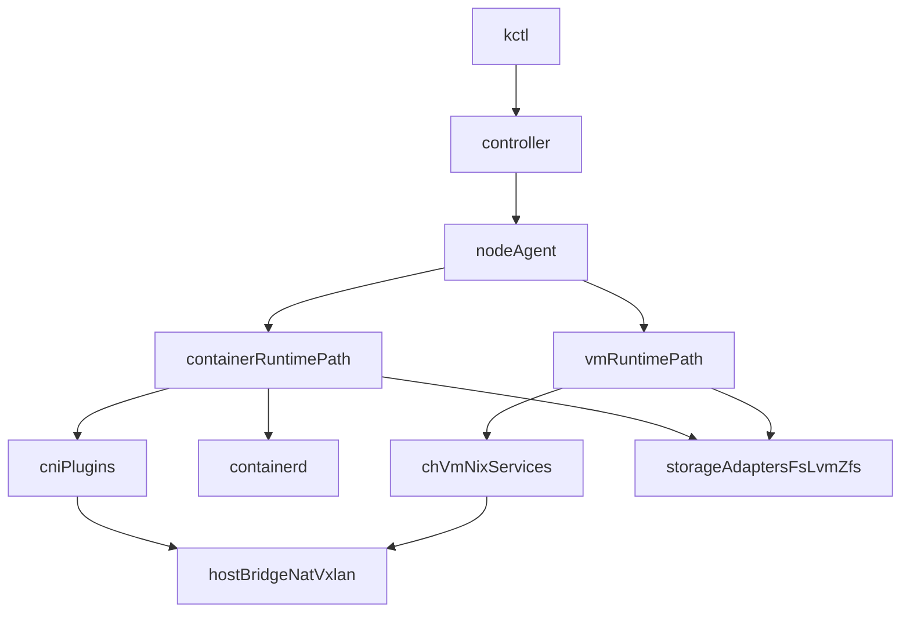

# Support for Containerd (Alongside VMs)

This document proposes a detailed implementation plan to add container
workloads using `containerd` while keeping the current VM path
(`cloud-hypervisor` + `ch-vm`) fully functional.

The goal is **containers and VMs coexisting** in kcore, sharing scheduling,
network inventory, and storage-class intent where possible.

## Executive summary

- Add a parallel runtime track for containers; do not replace VM runtime code.
- Keep existing network types (`nat`, `bridge`, `vxlan`) as the operator API.
- Implement container networking using CNI plugins without requiring Kubernetes.
- Map existing storage classes (`filesystem`, `lvm`, `zfs`) to container
  snapshotter/volume behavior with clear fallback rules.
- Roll out in phases with feature flags and compatibility-preserving migrations.

## Why this is a new runtime track (not a small patch)

Current architecture is VM-first and declarative via Nix:

- Controller persists VM specs and generates Nix in
  `crates/controller/src/nixgen.rs`.
- Node VM lifecycle is tied to `cloud-hypervisor` and systemd units via
  `modules/ch-vm/vm-service.nix`.
- Node compute service (`crates/node-agent/src/grpc/compute.rs`) is centered
  on VM semantics.

Containers need different primitives (OCI image refs, sandbox/container IDs,
snapshotters, CNI attach/detach), so we should add a dedicated container path
and keep VM behavior unchanged.

## Requirements

### Functional

1. Create, list, inspect, start, stop, and delete container workloads.
2. Support all existing network modes:
   - `nat`
   - `bridge`
   - `vxlan`
3. Support existing storage-class intent:
   - `filesystem`
   - `lvm`
   - `zfs`
4. Keep VM lifecycle and APIs backwards compatible.

### Non-functional

1. No Kubernetes dependency.
2. Deterministic reconciliation on node restart.
3. Clear failure surfaces (network attach, image pull, storage mount).
4. Observability parity with VM path (state sync + events + logs).

## Networking feasibility notes

### Is CNI Kubernetes-only?

No. CNI is a generic plugin interface. Kubernetes uses it heavily, but
`containerd` (or a Rust control layer) can invoke CNI plugins directly.

### Can CNI work with our VXLAN implementation?

Yes. Our host already provisions VXLAN-capable bridges in
`modules/ch-vm/networking.nix`. CNI can attach container veth endpoints to the
existing bridge; VXLAN transport remains host-level plumbing.

Important constraints:

- MTU for veth/container interfaces must match VXLAN overhead decisions.
- IPAM range must align with controller network records.
- Masquerade rules must not conflict between CNI and host nftables policy.

## High-level architecture

## API and data-model changes

## Controller API (`proto/controller.proto`)

Add workload-kind aware contracts while preserving VM endpoints.

Recommended approach:

1. Introduce `WorkloadKind` enum:
   - `WORKLOAD_KIND_VM`
   - `WORKLOAD_KIND_CONTAINER`
2. Add container-specific messages:
   - `ContainerSpec` (image ref, command, env, resource limits, network name,
     storage class/size, mounts, restart policy)
   - `ContainerInfo`
3. Add RPCs:
   - `CreateContainer`
   - `DeleteContainer`
   - `GetContainer`
   - `ListContainers`
   - `SetContainerDesiredState`

Reason to prefer parallel RPCs over overloading `Vm*`:

- Clear semantics and less migration risk for existing clients.
- Avoids optional-field sprawl in VM messages.

## Node API (`proto/node.proto`)

Add node-level container runtime operations:

- `CreateContainer`, `StartContainer`, `StopContainer`, `DeleteContainer`
- `GetContainer`, `ListContainers`
- `PullOciImage` (or image pull as part of create with policy)
- `AttachContainerNetwork` / `DetachContainerNetwork` (optional explicit RPCs;
  can also be internal to create/delete)

Keep current VM `NodeCompute` methods intact.

## Controller DB (`crates/controller/src/db.rs`)

Add dedicated persistence for container workloads:

- New table `containers` (recommended) instead of overloading `vms`.
- Fields:
  - `id`, `name`, `node_id`
  - `image_ref`
  - `network_name`
  - `storage_backend`, `storage_size_bytes`
  - `desired_state`, `runtime_state`
  - `container_id` (runtime ID on node)
  - timestamps and optional metadata (ports, env hash, etc.)

Migration strategy:

- Forward-only migration adding tables/indexes.
- No changes required to existing VM rows for phase 1.

## Node-agent runtime design

## New module layout (suggested)

- `crates/node-agent/src/runtime/mod.rs`
  - `trait WorkloadRuntime` (optional abstraction)
- `crates/node-agent/src/runtime/vm_runtime.rs` (wrapper over existing behavior)
- `crates/node-agent/src/runtime/containerd_runtime.rs`
- `crates/node-agent/src/runtime/cni.rs` (thin adapter for CNI execution)

Alternative: keep VM code where it is and add only
`containerd_runtime.rs`. This is lower churn and acceptable if a trait is not
immediately needed.

## Containerd integration details

1. Use containerd gRPC API from Rust (`tonic` clients generated from upstream
   protos vendored in-tree).
2. Lifecycle mapping:
   - controller desired state -> node runtime actions
   - create -> pull image -> prepare snapshot -> create task -> start
   - stop/delete -> stop task -> delete task -> delete container snapshot
3. Persist runtime IDs for reconciliation after restart.
4. Reconcile loop on node startup:
   - list known containers from local state
   - compare with controller desired state
   - converge and report.

## CNI integration strategy

Implement CNI as plugin-binary execution (not in-process Go libs):

1. Render CNI config JSON per network under a managed dir
   (example: `/var/lib/kcore/cni/net.d/`).
2. Execute plugin chain (`ADD`/`DEL`/`CHECK`) with proper env and stdin JSON.
3. Use container netns path from runtime task.
4. Parse and store CNI results (allocated IP, routes, iface names).

Benefits:

- Works without Kubernetes.
- Keeps implementation language-agnostic.
- Reuses standard CNI plugins (`bridge`, `host-local`, `portmap`, etc.).

## Network-mode mapping for containers

Map current operator-visible network types to CNI behavior:

### `nat`

- Attach to `kbr-<name>` bridge.
- Use CNI bridge plugin + IPAM (`host-local`).
- Enable masquerade once (prefer host-level nftables already used by kcore;
  avoid double NAT).

### `bridge`

- Attach to `kbr-<name>` bridge connected to upstream interface/VLAN.
- CNI bridge or macvlan/ipvlan mode depending on desired L2 semantics.
- No local NAT rules.

### `vxlan`

- Reuse host bridge already wired to VXLAN interface.
- CNI only handles endpoint attachment and IP assignment.
- Keep VNI, peers, and FDB management in current host networking logic.

## Storage mapping plan

Current storage adapter concepts in `crates/node-agent/src/storage/mod.rs`
remain useful for provisioning persistent volumes. Container runtime then
consumes those volumes via mounts.

### `filesystem`

- Default snapshotter: `overlayfs`.
- Persistent volumes: host directories/files under existing storage root.

### `lvm`

Two acceptable approaches:

1. Use LVM-backed volumes provisioned by existing adapter and bind-mount them
   into containers (phase 1 recommendation).
2. Add devmapper snapshotter support for container rootfs (phase 2+, optional).

### `zfs`

Two acceptable approaches:

1. Use ZFS-backed volumes provisioned by existing adapter and bind-mount
   (phase 1 recommendation).
2. Add zfs snapshotter support for container rootfs where available (phase 2+).

Recommendation: start with **volume-level backend mapping** first, keep rootfs
snapshotter default simple, then optimize per backend later.

## Controller implementation plan

Primary files:

- `crates/controller/src/grpc/controller.rs`
- `crates/controller/src/grpc/validation.rs`
- `crates/controller/src/db.rs`
- `crates/controller/src/node_client.rs`
- `crates/kctl/src/commands/*`

Changes:

1. Add container CRUD/state RPC handlers in controller.
2. Validate image refs, resource requests, network existence, and storage class.
3. Placement rules:
   - initial: reuse scheduler fit checks for CPU/memory/storage class
   - later: add container-density/overcommit policy.
4. Add state sync path for containers similar to `SyncVmState`.

## Nix and packaging changes

1. Ensure nodes have:
   - `containerd`
   - CNI plugin binaries
   - CNI config/state directories and permissions
2. Keep current `ch-vm` modules untouched for VM lifecycle.
3. Optionally introduce a new Nix module for container runtime support
   (`modules/container-runtime/...`) to avoid overloading `modules/ch-vm`.

## CLI and UX plan (`kctl`)

Add commands:

- `kctl create container`
- `kctl get containers`
- `kctl get container <name>`
- `kctl delete container`
- `kctl set container --state <running|stopped>`

Recommended flags:

- `--image` (OCI ref)
- `--network`
- `--cpu`, `--memory`
- `--storage-backend`, `--storage-size-bytes`
- `--env`, `--mount`, `--port` (as needed)

## Phased rollout

## Phase 0: Design freeze and contracts

- Finalize protobuf and DB schemas.
- Decide state model and failure semantics.
- Add feature flag `container_runtime_enabled`.

## Phase 1: Minimal viable containers

- Container CRUD + desired state.
- `nat` network support first.
- `filesystem` storage backend first.
- Basic `kctl` support.

Exit criteria:

- A container can be created, started, stopped, deleted reliably on one node.

## Phase 2: Network parity

- Add `bridge` and `vxlan` mappings.
- Validate MTU/IPAM/NAT interactions.
- Add multi-node VXLAN tests.

Exit criteria:

- Container networking parity with VM network types.

## Phase 3: Storage parity

- Add `lvm`/`zfs` volume provisioning + mounts.
- Add backend-aware placement and validation.

Exit criteria:

- Persistent container volumes work across all backend classes.

## Phase 4: Hardening and observability

- Reconciliation robustness.
- Metrics, event logs, richer status surfaces.
- Upgrade/migration tests and rollback strategy.

## Test plan (required matrix)

## Unit tests

- API validation (image ref, network/storage checks).
- CNI config rendering and plugin call contracts.
- storage backend mapping logic.

## Integration tests (single-node)

- For each network mode (`nat`, `bridge`, `vxlan` where possible):
  - create/start/stop/delete
  - outbound connectivity checks
  - expected IP assignment.
- For each storage backend (`filesystem`, `lvm`, `zfs`):
  - volume create/mount/write/read/delete.

## Multi-node tests

- VXLAN cross-host container-to-container connectivity.
- Failover/restart reconciliation behavior.

## Regression tests

- Existing VM workflows unchanged:
  - `kctl create vm`
  - Nix apply path
  - VM state sync and lifecycle.

## Risks and mitigations

1. **Network rule conflicts (CNI vs host nftables)**  
   Mitigation: choose single source of NAT policy per network type.

2. **Snapshotter/backend mismatch**  
   Mitigation: phase 1 uses conservative default snapshotter and volume mounts.

3. **Runtime drift after restarts**  
   Mitigation: deterministic reconciliation loop and persisted runtime IDs.

4. **API sprawl and operator confusion**  
   Mitigation: explicit `container` command group and parallel RPCs.

## Open decisions (to settle before implementation)

1. Keep VM and container APIs separate (recommended) vs unified workload API.
2. Use containerd native namespaces per tenant/project or single namespace.
3. Initial security profile defaults (capabilities, seccomp, rootless scope).
4. Whether to ship `nerdctl` for debugging ergonomics on nodes.

## Suggested first PR breakdown

1. Proto + generated code + DB migration scaffolding.
2. Node-agent containerd runtime skeleton + no-op controller wiring behind flag.
3. `nat` + filesystem happy-path end-to-end.
4. `bridge`/`vxlan` support.
5. `lvm`/`zfs` persistent volume support.
6. Docs and operator workflows.

## References in current tree

- `crates/controller/src/grpc/controller.rs`
- `crates/controller/src/nixgen.rs`
- `crates/node-agent/src/grpc/compute.rs`
- `crates/node-agent/src/storage/mod.rs`
- `modules/ch-vm/options.nix`
- `modules/ch-vm/networking.nix`
- `modules/ch-vm/vm-service.nix`
- `proto/controller.proto`
- `proto/node.proto`
