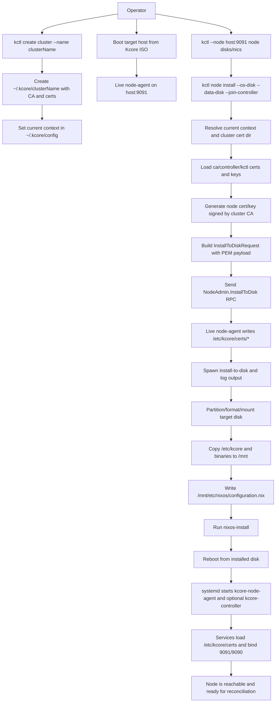

# Node Install Bootstrap Flow

This document defines the node installation procedure with cluster-scoped PKI material and certificate handoff from `kctl` to the target node.

## Goal

Install a node from live ISO to disk and ensure that, after reboot:
- `kcore-node-agent` can start with valid TLS files in `/etc/kcore/certs`
- the node can join or host the controller as configured
- certificate trust is anchored in the selected cluster CA

## Cluster-scoped PKI layout

Expected local layout on the operator machine:

- `~/.kcore/config` (contexts and current context)
- `~/.kcore/<cluster-name>/ca.crt`
- `~/.kcore/<cluster-name>/ca.key`
- `~/.kcore/<cluster-name>/controller.crt`
- `~/.kcore/<cluster-name>/controller.key`
- `~/.kcore/<cluster-name>/kctl.crt`
- `~/.kcore/<cluster-name>/kctl.key`

`kctl` selects a cluster context, resolves its cert directory, and uses that material for bootstrap.

## Procedure

1. Create/select cluster context and PKI.
2. Boot target host from Kcore ISO and confirm `node-agent` API is reachable.
3. Discover target devices (`node disks`, `node nics`).
4. Run `node install` with:
   - OS disk (required)
   - optional data disks
   - join controller endpoint
5. `kctl` prepares install PKI payload:
   - loads cluster CA and existing cert/key material
   - generates node cert/key signed by cluster CA (SAN = node host/IP)
6. `kctl` sends `InstallToDiskRequest` including cert PEM payload.
7. Live `node-agent` writes certs to `/etc/kcore/certs` and starts `install-to-disk`.
8. Installer copies `/etc/kcore/*` into `/mnt/etc/kcore` on target disk.
9. `nixos-install` completes and host reboots from installed disk.
10. Installed services read `/etc/kcore/certs/*` and start successfully.

## Detailed flowchart

## Verification checklist

- On live ISO (before install):
  - `kctl --node <host:9091> --insecure node disks`
  - `kctl --node <host:9091> --insecure node nics`
- During install:
  - install response includes accepted status and log path
  - logs show full installer progression and final status
- After reboot:
  - `findmnt /` shows root on installed disk
  - `/etc/kcore/certs` exists with expected files
  - `systemctl is-active kcore-node-agent` is `active`
  - if same-host controller mode, `systemctl is-active kcore-controller` is `active`

